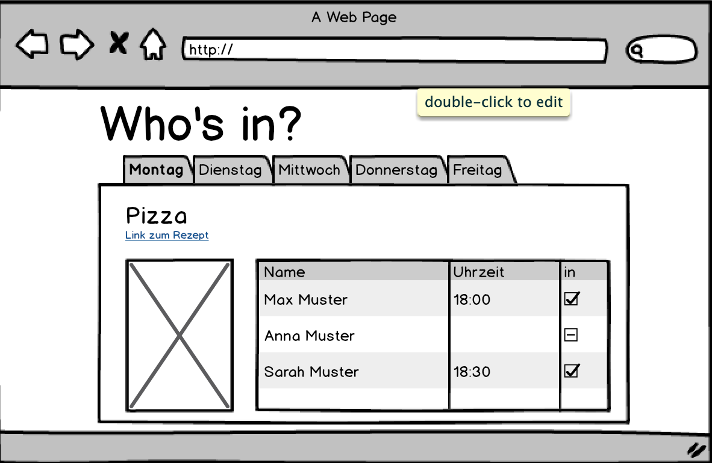
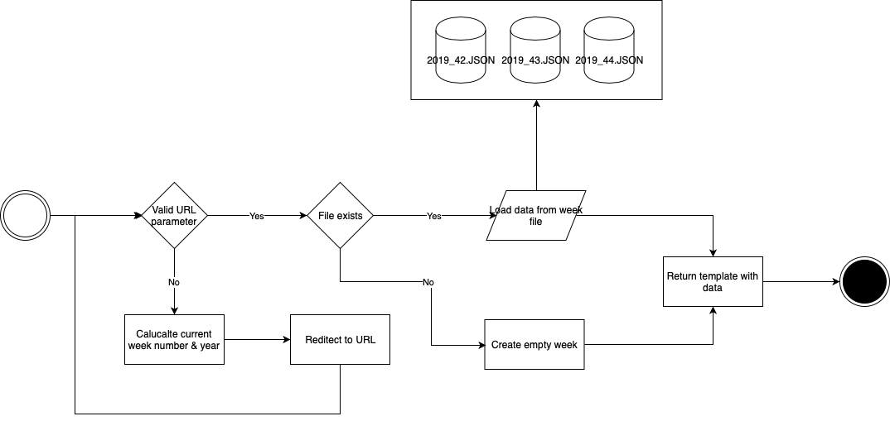

# Who's there
  
## Ausgangslage
In einem Haushalt in dem alle zu unregelmässigen Arbeitszeiten arbeiten, ist die koordination am Abend sehr schwierig. 
> *Wer isst heute Abend zuhause?*

Dies ist die wohl meistgestellte Frage im Familienchat und genau dieses Problem soll mit *Who's there* gelöst werden.

## Funktion/Projektidee
Das Tool sollte die Funktionalität besitzen, anzuzeigen wer an welchem Wochentag am Abend zum Nachtessen zuhause sein wird. Zudem sollte es möglich sein das Wochenmenü bereits im Voraus zu definieren, sowie zu definieren wann das Nachtessen bereit sein wird. 
Das Tool sollte über den Browser bedienbar sein, zusätzlich wäre es zu wünschen wenn weitere Integrationen wie zum Beispiel in Telegram zur Verfügung stehen würden.

## Installation

## Workflow
1. Im Browser wird eine neue Woche erstellt in welcher auch gleich das Wochenmenü definiert werden kann.
2. Die Familienmitglieder geben im Browser ein, an welchen Wochentagen sie zuhause sein werden.
3. Eine Übersicht wird auf einem Bildschirm zuhause angezeigt, sowie kann der aktuelle Stand auch über den Browser aufgerufen werden.

- Alle Einstellungen zum Wochenmenü sollten jederzeit angepasst werden können.

## Mockup
Skizze des Dashboards auf welchem die aktuelle Woche angezeigt wird.

## Workflow
### Dateneingabe
Um eine neue Woche hinzuzufügen wird über das Webinterface die entsprechende Seite aufgerufen. In dem UI kann der Benutzer über eine Eingabemaske jeweils pro Wochentag den Titel der Mahlzeit definieren. Die Eingabe wird in einem File auf dem System gespeichert, sodass es für die Übersicht wieder aufgerufen werden kann.

### Datenverarbeitung/Speicherung
Alle Daten werden als json in `.txt` Dateien im Ordner `data/` gespeichert. Dabei wird zwischen zwei Arten von Daten unterschieden. Es gibt die `week_data/` und die `users.txt`

##### Week data
Im Ordner `week_data/` wird pro Woche die eingetragen wird ein neues File angelegt. Dieses File enthält danach folgende Informationen:

- Wochentage und ihr Datum
- Menu pro Wochentag
- Alle Personen die bereits zu- oder abgesagt haben

##### users.txt
Im File `users.txt` werden die Informationen für das Login gespeichert. Das File beinhaltet ein Dictionary mit allen Usernamen, Passwörter und deren Berechtigungen.

### Datenausgabe
1. Zuerst wird überprüft ob valide Parameter in der URL übergeben worden sind. Zum Beispiel `/2019/42` für die 42. Woche im Jahr 2019.
2. Falls keine gültigen Parameter eingegeben wurden, wird die aktuelle Kalenderwoche ermittelt und auf diese Seite redirected.
3. Als nächstes wird überprüft ob bereits ein Wochenplan für diese Woche erstellt worden ist. 
4. Falls dies nicht der Fall ist wird eine leere Woche erstellt.
5. Zum Schluss wird die Seite mit den entsprechenden Daten geladen.

## Benutzeranleitung